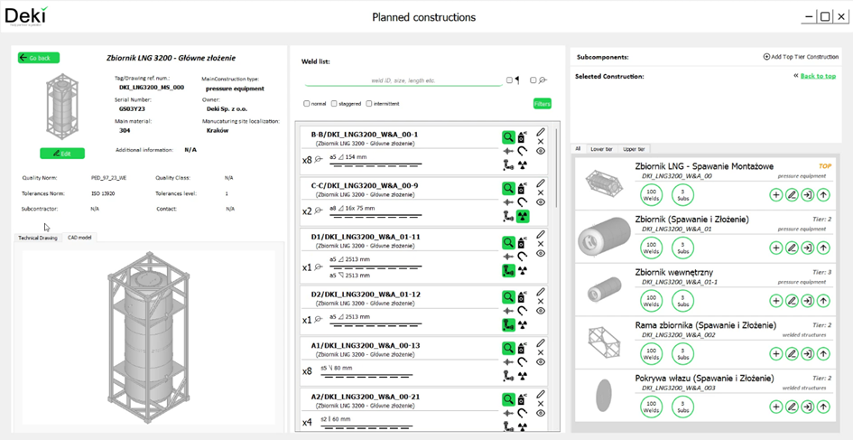
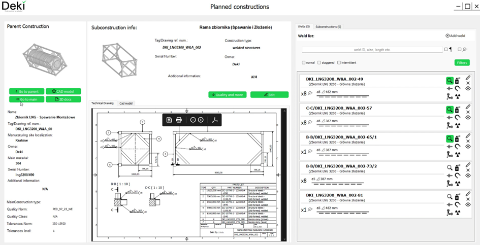
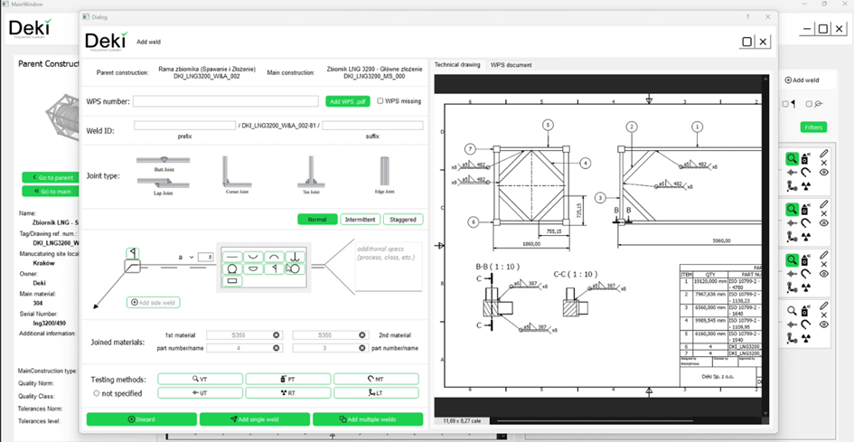

The project involves the development of an MVP application for a startup focused on organizing quality control in welding. The project uses:
•	PyQt5
•	pyOCCT (operations with CAD models)
•	Libraries for data management and databases (MariaDB) – Pandas, Numpy etc.
The project integrates a GUI with the backend and creates an API for collaboration with a database (MariaDB) configured on a private server, accessible over the Internet. The application itself has the functionality to work with CAD models and .pdf files. The application consists of several screens, with the front end designed in QT Designer.

Example Application Screenshots:

Check out the video showcasing the application's functionality on startup's website:
    https://deki.com.pl

## License
All rights reserved by krzysiek-droid. No part of this software may be reproduced, distributed, or transmitted in any form or by any means, including photocopying, recording, or other electronic or mechanical methods, without the prior written permission of the author, except in the case of brief quotations embodied in critical reviews and certain other 
